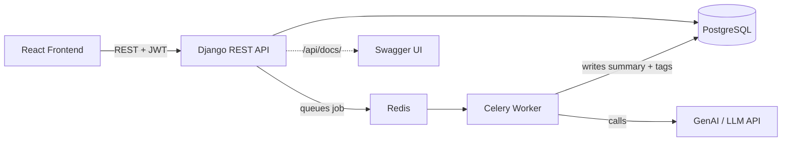

# AI Notes & Task Assistant


A full-stack notes/task manager with an asynchronous GenAI pipeline that
auto-summarizes and auto-tags notes. Built to demonstrate an end-to-end
Django + DRF + PostgreSQL + Celery/Redis + React stack with a real GenAI
integration, CI, and API documentation.

**Live demo:** _add your deployed link here once deployed (see "Deploying it" below)_
**API docs:** `/api/docs/` once running (Swagger UI)

## Features
- JWT-authenticated REST API (Django REST Framework)
- Notes & Tasks CRUD, scoped per user, with **pagination, search, and filtering**
- Async background processing with **Celery + Redis**
- **GenAI integration**: each note is summarized and auto-tagged by an LLM
  in the background (provider-agnostic service layer — swap in OpenAI,
  Anthropic, or Gemini by editing one file, `notes/ai_service.py`)
- **Interactive API docs** via `drf-spectacular` (Swagger UI at `/api/docs/`)
- **Rate limiting** on the API (per-user and per-IP throttling)
- Structured logging for key events (note creation, AI reprocessing)
- `/health/` endpoint for uptime monitoring
- PostgreSQL in production, SQLite fallback for instant local demos
- **CI pipeline (GitHub Actions)**: runs migrations, the test suite, and
  flake8 linting on every push
- Unit + integration tests (DRF `APITestCase`)
- Dockerized (Dockerfile + docker-compose) and deploy-ready (Render blueprint)
- React frontend that polls for AI results as they complete

## Architecture


## Setup

### Backend
```bash
python -m venv venv && source venv/bin/activate
pip install -r requirements.txt
cp .env.example .env   # fill in DB / Redis / GenAI keys, or leave blank for SQLite + fallback summaries
python manage.py migrate
python manage.py createsuperuser
python manage.py runserver
```

### Celery worker (needs Redis running locally)
```bash
celery -A config worker -l info
```

### Frontend
```bash
cd frontend
npm install
npm run dev
```

## API Overview
| Endpoint | Method | Description |
|---|---|---|
| `/api/accounts/register/` | POST | Create a user |
| `/api/auth/token/` | POST | Get JWT access/refresh tokens |
| `/api/notes/notes/` | GET/POST | List / create notes |
| `/api/notes/notes/{id}/reprocess/` | POST | Re-run AI summarization |
| `/api/notes/tasks/` | GET/POST | List / create tasks |

## Tests
```bash
python manage.py test
```

## Suggested CV bullet points
- Built a full-stack notes/task manager using **Django REST Framework, PostgreSQL, and JWT auth**, with per-user data isolation, pagination, search, and filtering.
- Implemented **asynchronous background processing with Celery and Redis** to offload GenAI calls from the request/response cycle.
- Integrated a **GenAI/LLM API** to auto-summarize and auto-tag user content, with a provider-agnostic service layer and graceful fallback logic.
- Set up a **CI pipeline with GitHub Actions** running automated tests and linting against a live Postgres + Redis service on every push.
- Added **interactive OpenAPI/Swagger documentation** (`drf-spectacular`) and API rate limiting for production readiness.
- Wrote **unit and integration tests** (DRF `APITestCase`) covering API permissions, search, and async task triggering.
- Containerized the app with **Docker/docker-compose** and deployed it to **Render** (backend/worker/Postgres/Redis) and **Vercel** (frontend).
- Built a **React** frontend consuming the DRF API, with polling to reflect async AI results in real time.

## Deploying it

### Backend + worker + Postgres + Redis → Render (free tier)
1. Push this repo to GitHub.
2. In Render: **New → Blueprint**, connect the repo. Render reads `render.yaml`
   and creates the web service, Celery worker, a free Postgres database, and
   a free Redis instance automatically.
3. When prompted, set `GENAI_API_KEY` (optional — falls back to a naive
   summarizer without it) and, once you know your frontend's URL,
   `CORS_ALLOWED_ORIGINS` / `CSRF_TRUSTED_ORIGINS` (comma-separated, e.g.
   `https://your-frontend.vercel.app`).
4. Render builds the Docker image, runs migrations automatically
   (`preDeployCommand`), and gives you a live URL like
   `https://ai-notes-backend.onrender.com`.

No `render.yaml`/blueprint access, or prefer manual setup? Create the four
resources yourself in the Render dashboard (Web Service from Dockerfile,
Background Worker with command `celery -A config worker -l info`, a
Postgres instance, a Redis instance) and wire the same env vars by hand.

### Frontend → Vercel (free tier)
1. In Vercel: **New Project**, import the same repo, set the root directory
   to `frontend/`.
2. Add an environment variable `VITE_API_URL` = your Render backend URL +
   `/api` (e.g. `https://ai-notes-backend.onrender.com/api`).
3. Deploy. Vercel auto-detects Vite from `frontend/vercel.json`.

### Local full-stack run with Docker
```bash
docker compose up --build
```
This starts Postgres, Redis, the Django API, and the Celery worker together.
Run migrations happen automatically on the `web` container's startup.

**Note on Render's free tier:** free web services sleep after inactivity and
the free Postgres/Redis instances expire after ~90 days — fine for a CV demo
link, not for anything long-term. Mention this if a recruiter asks about
production readiness; it's a fair trade-off to call out, not a flaw to hide.

